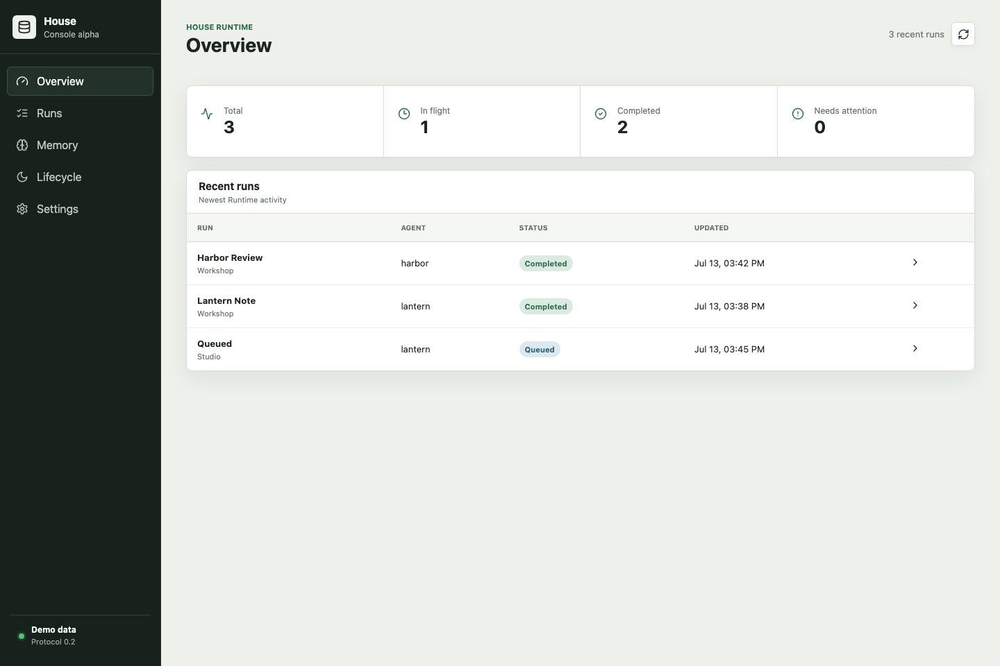

# House Console

Maintenance release `0.1.0-alpha.2` preserves the existing maturity and document profiles. See [CHANGELOG.md](CHANGELOG.md) for dependency changes and consumer lockfile guidance.

House Console is an experimental, read-only operational client for House Runtime. It makes durable Runs, Evidence, Initiatives, memory records, and lifecycle records visible without importing a private House instance.

The alpha uses the transport-neutral Runtime API from House Protocols `v0.3.0-rc.2` and the authenticated read surface in House Runtime `v0.3.0-rc.2`.

## Five-minute demo

```bash
npm install
npm run dev
```

Open `http://127.0.0.1:4173`. Demo mode starts with two fictional agents and no network request.

The Runs view lists durable work and reads its linked Evidence and Initiative records. Memory and Lifecycle query records by fictional subject. Settings switches between Demo and Live modes without storing a token.



## Live connection

Set the Runtime endpoint at build time or enter it for the current page session:

```bash
VITE_HOUSE_RUNTIME_ENDPOINT=/api/runtime npm run dev
```

The host must expose a same-origin or explicitly allowed HTTPS endpoint and authenticate the browser with a `Secure`, `HttpOnly`, `SameSite` session cookie. The Console sends `credentials: include`. It never accepts a token in URL parameters or stores one in local storage.

The public Runtime candidate is a method service, not a complete login server or reverse proxy. A deployment must provide those host boundaries.

## Included

- Overview counts and recent Runs
- Run status filters and Run details
- Linked Evidence and Initiative readback
- Memory queries with an explicit quarantine toggle
- Journal, Dream, and Handoff queries
- Runtime health and ephemeral endpoint settings
- Desktop and mobile browser tests

## Not included

- A real House instance, agent, memory, Keel, prompt, schedule, or relationship
- Login, session issuance, reverse proxy, or TLS configuration
- Chat, model calls, external connectors, or tool execution
- Memory mutation, deletion, export, approval, or administrative writes
- Forum, game, email, or social features

## Security boundary

Every non-health Runtime request still requires host authorization. Hiding a navigation item is not authorization. Request envelopes reject client-supplied authentication fields, and the Console has no API for sensitive mutations.

Run `npm run check` for unit tests, production build, and private-data scanning. Run `npm run test:e2e` for desktop and mobile browser verification.

See [COMPATIBILITY.md](COMPATIBILITY.md), [ROADMAP.md](ROADMAP.md), [SECURITY.md](SECURITY.md), and [CONTRIBUTING.md](CONTRIBUTING.md).

## License

AGPL-3.0-only. See [LICENSE](LICENSE).
